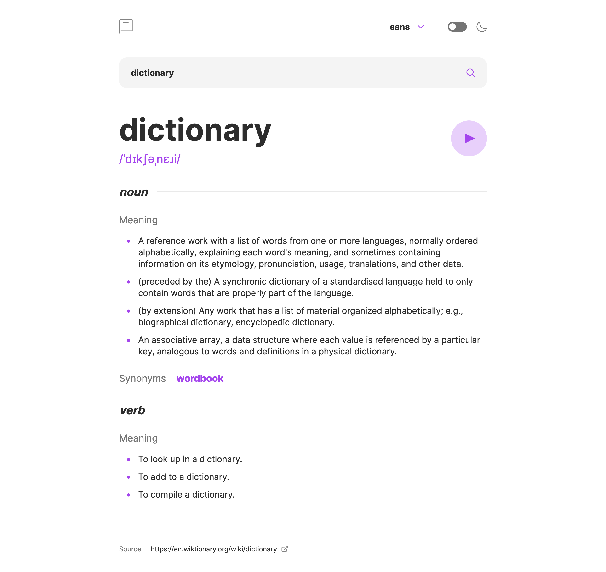
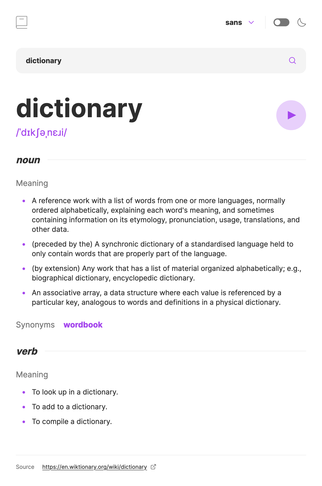
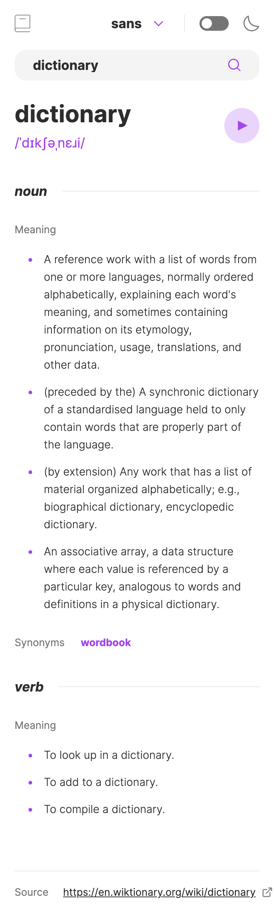

# Frontend Mentor - Dictionary web app solution

- Live Site URL: [Dictionary](https://dictionary-web-app-cz.vercel.app/)

This is a solution to the [Dictionary web app challenge on Frontend Mentor](https://www.frontendmentor.io/challenges/dictionary-web-app-h5wwnyuKFL). Frontend Mentor challenges help you improve your coding skills by building realistic projects.

### Built with

- [React](https://reactjs.org/)
- [Next.js](https://nextjs.org/) - React framework
- [Tailwind CSS](https://tailwindcss.com/) - For styles
- TypeScript

### What I Enjoyed Learning:

- Typing with React. More specifically typing by inference. I used [zod](https://zod.dev/?id=introduction) ( schema declaration and validation library) to parse the data coming back from the API to inference the type.
- Using `useContext` for state management. Avoided messy prop drillings without extra library such as Redux.
- Getting rid of random classNames for styling purposes. First time trying [Tailwind](https://tailwindcss.com/) and I feel like I will never go back.

### Screenshot

### The challenge

Users should be able to:

- Search for words using the input field
- See the Free Dictionary API's response for the searched word
- See a form validation message when trying to submit a blank form
- Play the audio file for a word when it's available
- Switch between serif, sans serif, and monospace fonts
- Switch between light and dark themes
- View the optimal layout for the interface depending on their device's screen size
- See hover and focus states for all interactive elements on the page
